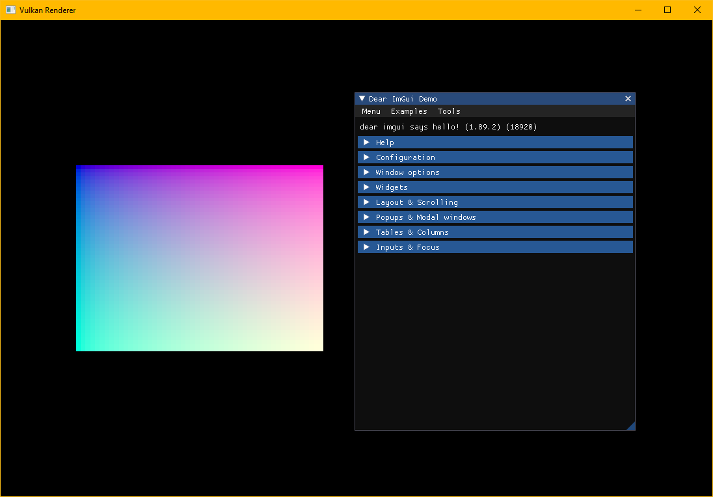

# Toy Engine

<p align="center">
  <a href="https://github.com/devodev/toy-engine">
    
  </a>
</p>

## Table of contents

- [Overview](#overview)
- [Dependencies](#dependencies)
  - [Setup using MSVC on Windows](#setup-using-msvc-on-windows)
- [Development](#development)
  - [Debug Graphics](#debug-graphics)
- [Benchmarks](#benchmarks)
  - [Getting Started](#getting-started)
  - [Run Benchmarks](#run-benchmarks)

## Overview

This project is a playground for me to learn Graphics Programming, and in particular the [Vulkan Graphics API](https://www.khronos.org/vulkan/).

We will be using [Rust](https://www.rust-lang.org/) as the programming language and the following libraries:

- [rust-windowing/winit](https://github.com/rust-windowing/winit): Cross-platform window creation and management in Rust.
- [ash-rs/ash](https://github.com/ash-rs/ash): Very lightweight Rust wrapper around Vulkan.
- [imgui-rs/imgui-rs](https://github.com/imgui-rs/imgui-rs): Rust bindings for [Dear ImGui](https://github.com/ocornut/imgui).
- [rustgd/cgmath](https://github.com/rustgd/cgmath): A linear algebra and mathematics library for computer graphics.

## Dependencies

### Setup using MSVC on Windows

1. Install rust: <https://www.rust-lang.org/tools/install>.
2. Set the default Rust toolchain to msvc: `rustup default nightly-x86_64-pc-windows-msvc`.
   1. We are using nightly so that we can benefit from latest features.
3. Use rustfmt nightly: `cargo +nightly fmt`.
4. Install LunarG Vulkan SDK: <https://www.lunarg.com/vulkan-sdk/>

## Development

### Debug Graphics

> <https://renderdoc.org/>

We can use [RenderDoc](https://renderdoc.org/), an open-source Graphics debugger, to obtain
quick and easy single-frame capture and detailed introspection of ourt application.

1. Open RenderDoc and select the **Launch Application** tab.
2. Set **Executable Path** to `toy_engine/target/debug/sandbox.exe`.
3. Click **Launch**. The Sandbox app should start, and a new **sandbox [PID XXXXX]** tab should appear.
4. Update **Tools** attributes as needed, and then click **Capture Frame(s) Immediately** to capture frames.
5. Enjoy all the debugging features that RenderDoc has to offer!

## Benchmarks

Benchmarks powered by [Criterion](https://github.com/bheisler/criterion.rs) are available under [benches](./benches/).

### Getting Started

> <https://crates.io/crates/cargo-criterion>

Install Criterion by running the following command:

```bash
cargo install cargo-criterion
```

### Run Benchmarks

To run all benchmarks, navigate to the root of the repo and run the following command:

```bash
cargo criterion
```

Or run a specific bench:

```bash
cargo criterion bench_quad_batcher_add_quad_100
```
